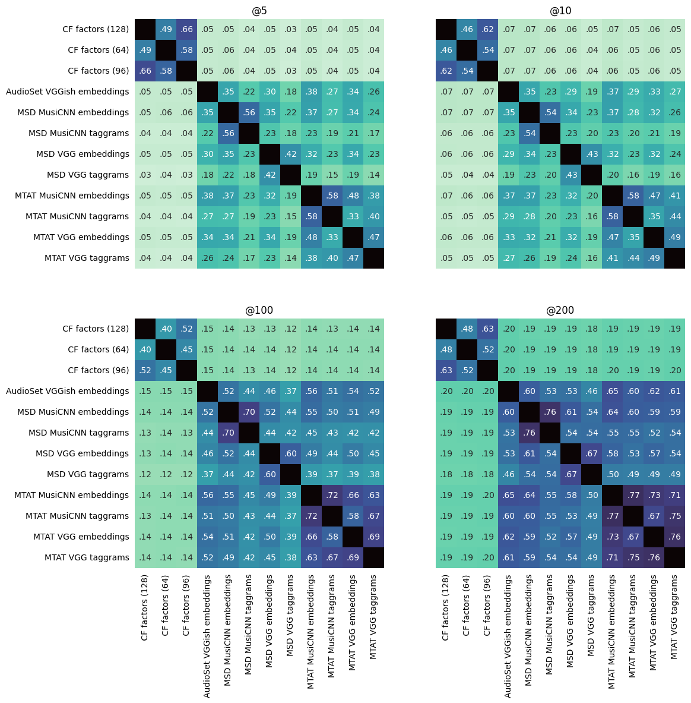
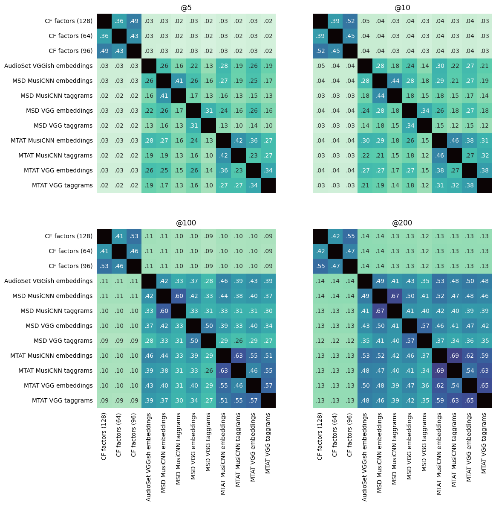
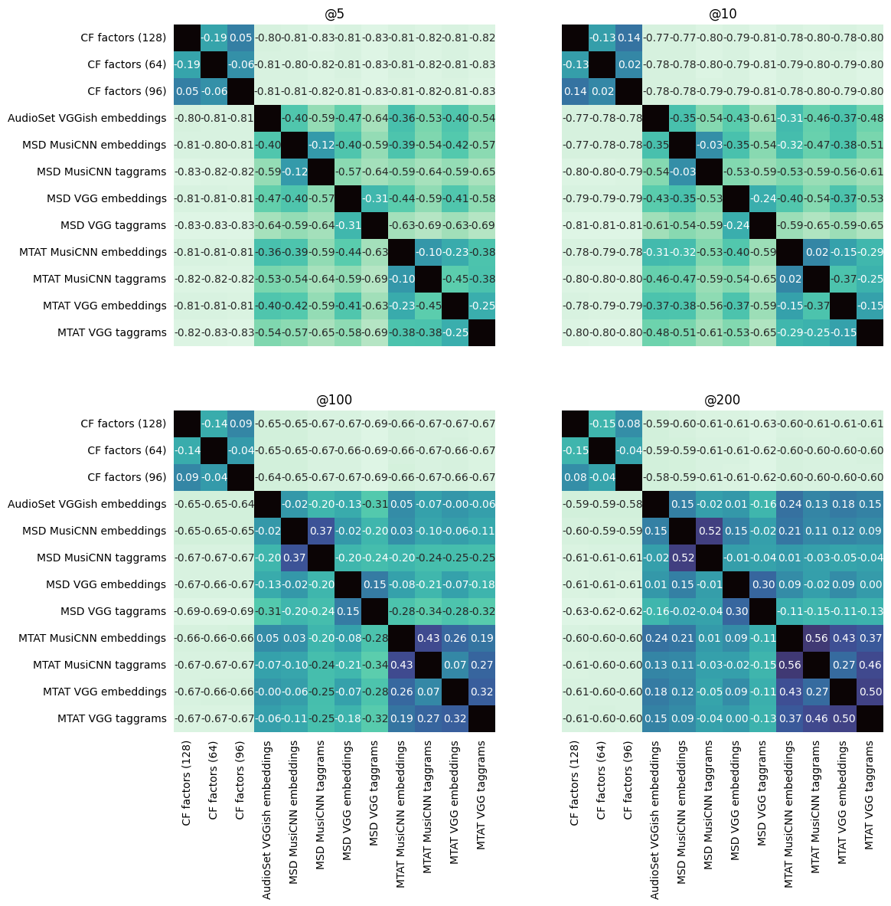

# Other metrics

## S_n, introduced in the paper



## Rank-based overlap (RBO, [implementation](https://github.com/changyaochen/rbo))




## Spearman index

```
def calculate_idx(items_x, items_all):
	return [index(item, items_x) if item in items_x else len(items_x) for item in items_all]

items_all = items_a | items_b
idx_a = calculate_idx(items_a, items_all)
idx_b = calculate_idx(items_b, items_all)
similarity = spearman_correlation(idx_a, idx_b)
```

