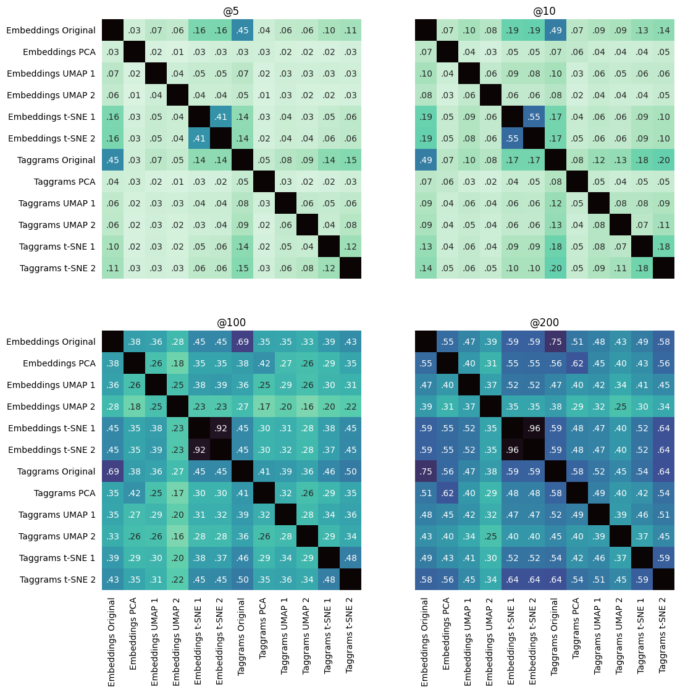

# Projections: more figures

*Due to a bug in the code, the figure in the paper is slightly different from the euclidean-small presented here. This doesn't change the discussion significantly, and the figure will be updated in a camera-ready version*

## Euclidean similarity, small dataset (presented in the paper)

## Euclidean similarity, large dataset

## Cosine similarity, small dataset

## Cosine similarity, large dataset

