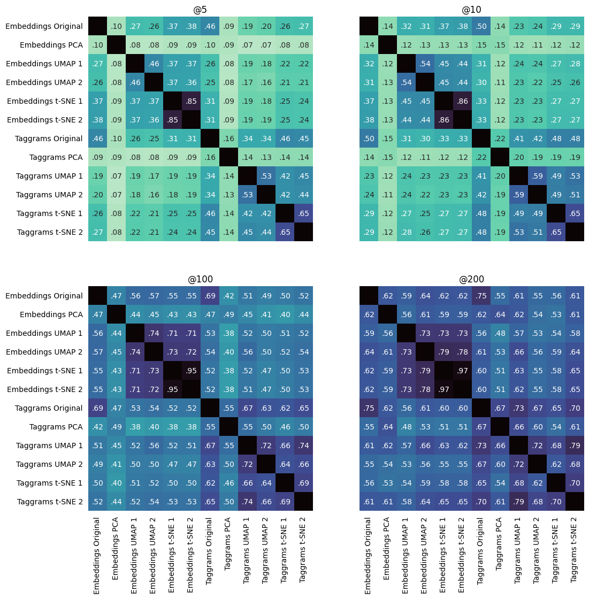

# Projections: more figures

*Due to a bug in the code, the figure in the paper is slightly different from the euclidean-small presented here. This doesn't change the discussion significantly, and the figure will be updated in a camera-ready version*

| Distance \ Dataset | Small | Large |
| --- | --- | --- | 
| Euclidean |  |   | 
| Cosine    |     |      | 
