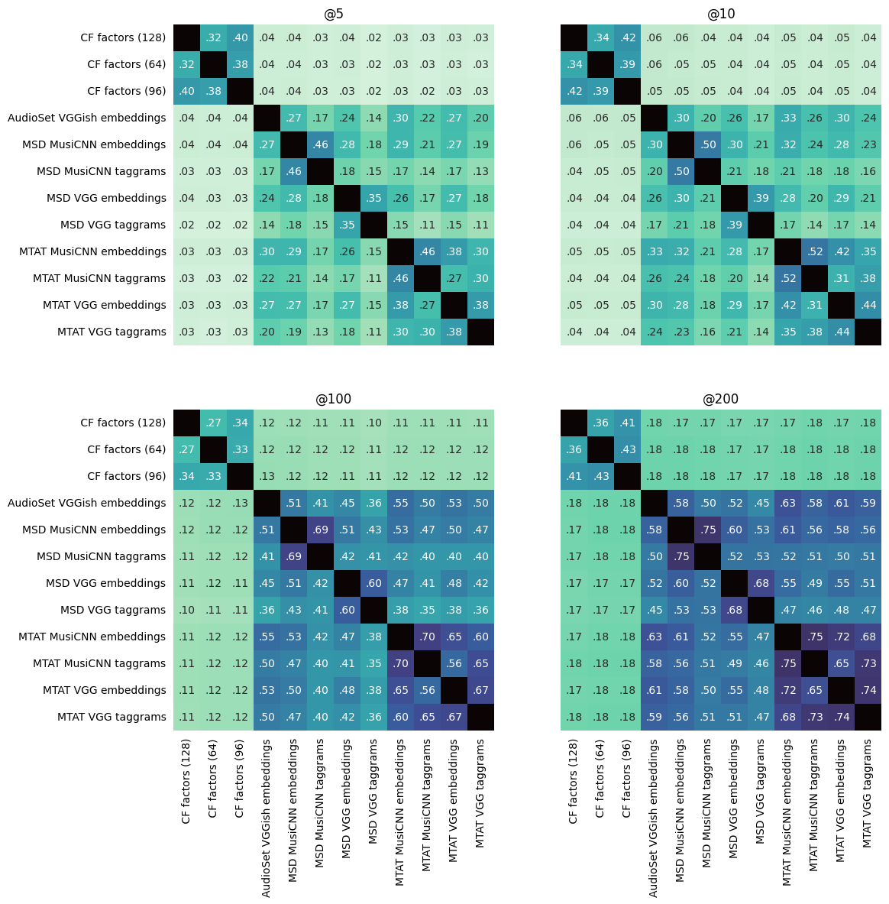
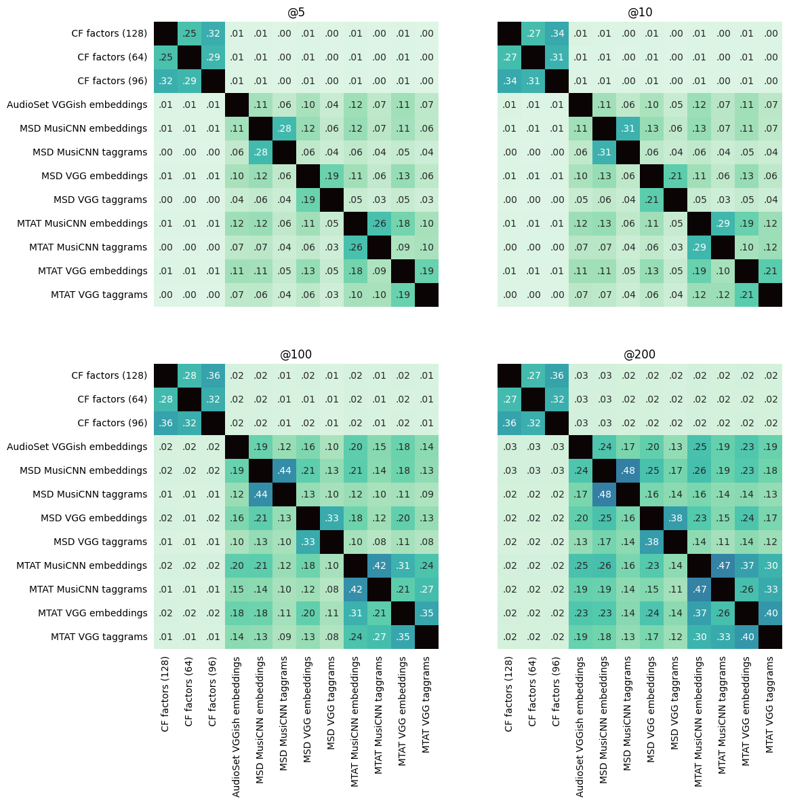
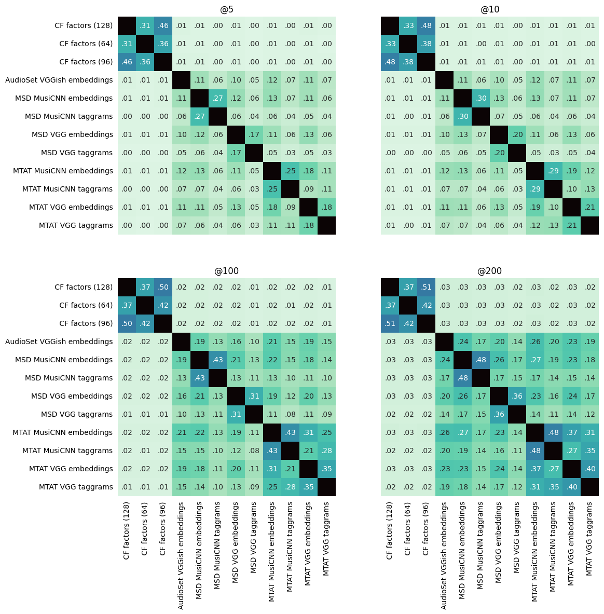

# Latent spaces experiment: more figures

## Euclidean similarity, small dataset 

## Euclidean similarity, large dataset

## Cosine similarity, small dataset (presented in the paper)

## Cosine similarity, large dataset

